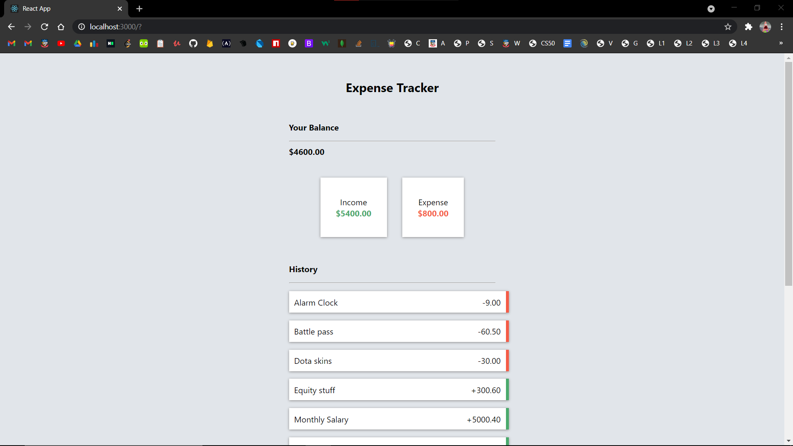
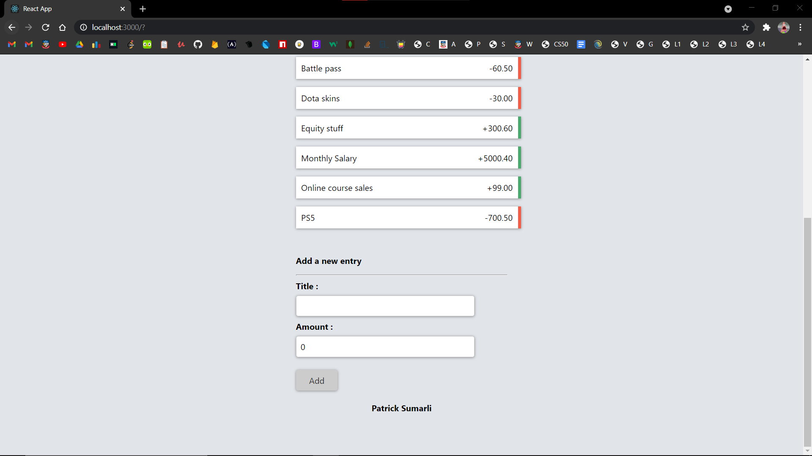

# A React Expense Tracker

An expense tracker created with React and Firebase's Realtime Database

Design is inspired by <a href="https://www.youtube.com/watch?v=XuFDcZABiDQ&t=48s">Traversy Media</a>

Code is my own

<h2>Screenshots</h2>

